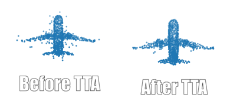
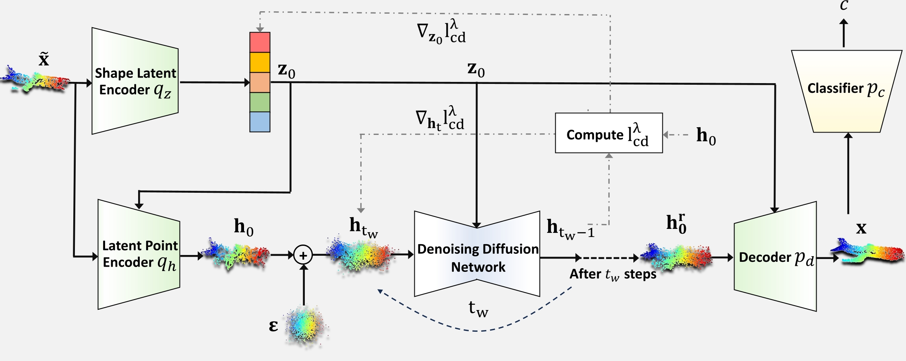

# Training-free Online 3D Test-Time Adaptation via Denoising Diffusion Process

**Test-time adaptation (TTA)** of 3D point clouds is essential for addressing discrepancies between training and testing samples, particularly in corrupted point clouds like those from LiDAR data. Adapting models online to distribution shifts is crucial, as training for every variation is impractical. Existing methods often fine-tune models using self-supervised learning or pseudo-labeling, which can result in forgetting source domain knowledge.

We propose a training-free, online 3D TTA method called **3DD-TTA** (3D Denoising Diffusion Test-Time Adaptation), which adapts input point clouds using a diffusion strategy while keeping the source model unchanged. A Variational Autoencoder (VAE) encodes corrupted point clouds into latent spaces, followed by a denoising diffusion process. 

  

## Key Features:
- **No fine-tuning required**: Keeps the source model intact.
- **Diffusion strategy**: Updates the corrupted latent points for alignment with the source domain.
- **Strong performance**: Achieves state-of-the-art results on ShapeNet, ModelNet40, and ScanObjectNN.

## Results:
Our method demonstrates superior generalization across multiple datasets, including:
- ShapeNet
- ModelNet40
- ScanObjectNN
